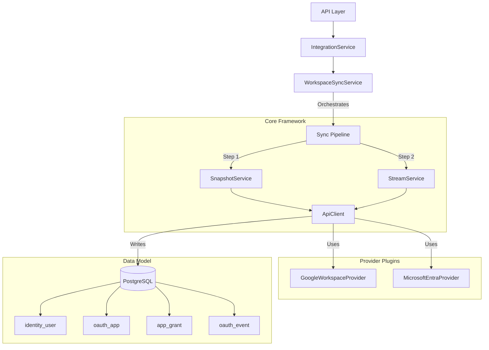

# Integration Service Architecture

## 1. Architectural Principles

The Integration Service is the centralized gateway for all external SaaS provider interactions. It adheres to:

1.  **Async-First**: High concurrency using `asyncio`.
2.  **Centralized Control**: All HTTP/API logic flows through `ApiClient` for consistent rate limiting, logging, and auth.
3.  **Hybrid Sync Engine**: Combines **Snapshot** (State) and **Stream** (Events) strategies for 100% accuracy.
4.  **Provider Agnostic Core**: Core logic (`app/integrations/core/`) is generic; specifics (Google, Okta) are plugins.
5.  **Strict Schema Alignment**: Data models strictly match the PRD (`oauth_app`, `app_grant`, `oauth_event`).

---

## 2. High-Level Architecture



---

## 3. Core Framework Components

### 3.1 `ApiClient` (The Gateway)
Central entry point for all external calls.
*   **Responsibilities:**
    *   Injecting Authentication (Access Tokens).
    *   **Rate Limiting** (Global & Per-Endpoint).
    *   Automatic Retries (429, 5xx).
    *   **Pagination** (Auto-fetching next pages).

### 3.2 `SyncOrchestrator` (The Hybrid Engine)
Manages the execution order of sync jobs.
*   **Strategy:** "Hybrid Sync" (See `consolidated_sync_strategy.md`).
*   **Pipeline Steps:**
    1.  `SyncStep.USERS` (Directory API)
    2.  `SyncStep.GROUPS` (Directory API)
    3.  `SyncStep.GROUP_MEMBERS` (Directory API)
    4.  `SyncStep.SNAPSHOT_TOKENS` (Directory API - `tokens.list`) -> **Ground Truth**
    5.  `SyncStep.STREAM_EVENTS` (Reports API - `activities.list`) -> **History**

---

## 4. Data Layer (Schema Alignment)

Crucial: The code must match the Database Schema exactly.

| Concept | DB Table Name | Python Model (Internal) |
| :--- | :--- | :--- |
| **Organization** | `organization` | `Organization` |
| **Connection** | `identity_provider_connection` | `IdentityProviderConnection` |
| **User** | `identity_user` | `IdentityUser` |
| **Group** | `identity_user_group` | `IdentityGroup` |
| **App** | `oauth_app` | `OAuthApp` |
| **Grant** | `app_grant` | `AppGrant` |
| **Event** | `oauth_event` | `OAuthEvent` |

---

## 5. Scope Handling Strategy (Crucial)

We have two sources of truth for scopes. Here is how we resolve conflicts.

### A. The "Union" Problem
A user might authorize an app, then re-authorize with *fewer* scopes. If we just "union" everything, we show false positives.

### B. The Logic

1.  **Snapshot (Ground Truth)**:
    *   When we run a `tokens.list` (Snapshot), we get the **exact current scopes**.
    *   **Action:** **OVERWRITE** `app_grant.scopes` with this list.
    *   *Why:* This is the reality right now.

2.  **Event Stream (History)**:
    *   When we see an `authorize` event, it contains the scopes *requested at that time*.
    *   **Action:** 
        *   Log specific scopes in `oauth_event.scopes` (Immutable History).
        *   **Merge** into `app_grant.scopes` (Union) **ONLY IF** we haven't run a Snapshot recently (fallback logic).

**Rule:** Snapshot > Event Union.

---

## 6. Google Workspace Implementation Details

### 6.1 Batching for `tokens.list` (Rate Limit Safety)

*   **Challenge:** `tokens.list` is per-user. For 10k users, that's 10k calls.
*   **Solution:** Google Batch API.
*   **Rate Limit Warning:** Google counts *each inner request* in a batch against the quota (1,500/100s).
*   **Implementation:**
    *   Batch Size: 50 requests per batch.
    *   Concurrency: Max 3 parallel batch requests.
    *   **Throttling:** The `ApiClient` must implement a "Virtual Cost" logic. A batch request of 50 items has a cost of 50, not 1.

### 6.2 Provider Configuration

```python
class GoogleWorkspaceProvider(BaseProvider):
    def get_sync_pipeline(self) -> list[SyncStep]:
        return [
            SyncStep.USERS,          # admin.directory.user.readonly
            SyncStep.GROUPS,         # admin.directory.group.readonly
            SyncStep.GROUP_MEMBERS,  # admin.directory.group.readonly
            SyncStep.SNAPSHOT_TOKENS, # admin.directory.user.security
            SyncStep.STREAM_EVENTS    # admin.reports.audit.readonly
        ]
```

### 6.3 Mapping Event Types

| Google Event Name | Internal `EventType` | Action |
| :--- | :--- | :--- |
| `authorize` | `authorize` | Upsert `app_grant`, Log Event |
| `revoke` | `revoke` | Update `app_grant` (revoked), Log Event |
| `app_authorization` | `authorize` | (Alias for authorize) |
| `activity` | `activity` | Update `last_accessed_at`, Log Event |

---

## 7. Extending for Future Providers (e.g. Okta)

The architecture is plugin-based. To add Okta:
1.  Implement `OktaProvider(BaseProvider)`.
2.  Map Okta's "App User grants" to `app_grant`.
3.  Map Okta's "System Log" to `oauth_event`.
4.  No core code changes required.

---
**Status:** Aligned with PRD v2.2 and Consolidated Sync Strategy.
